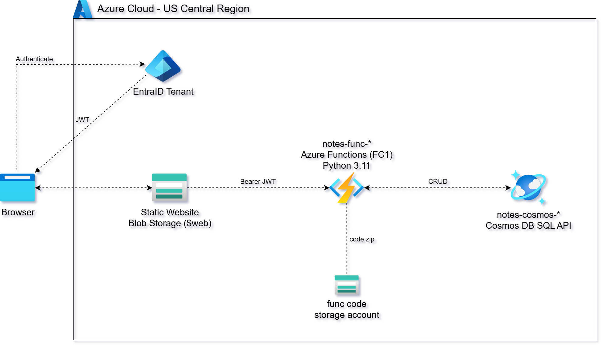
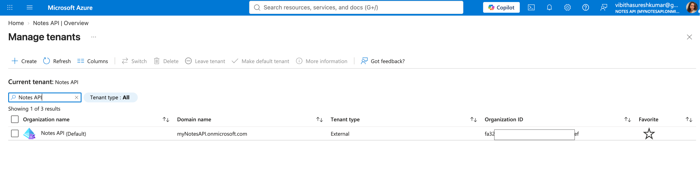
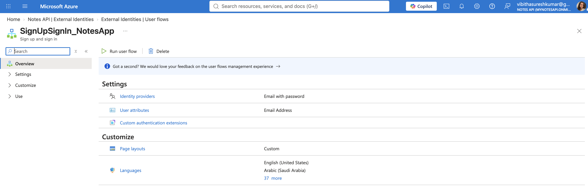
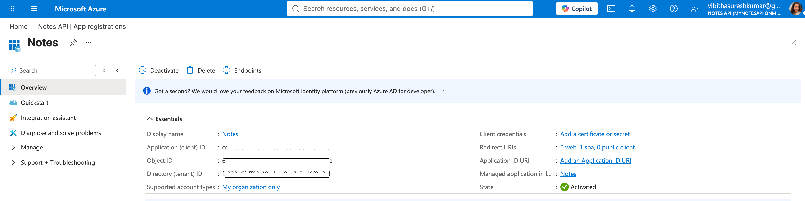
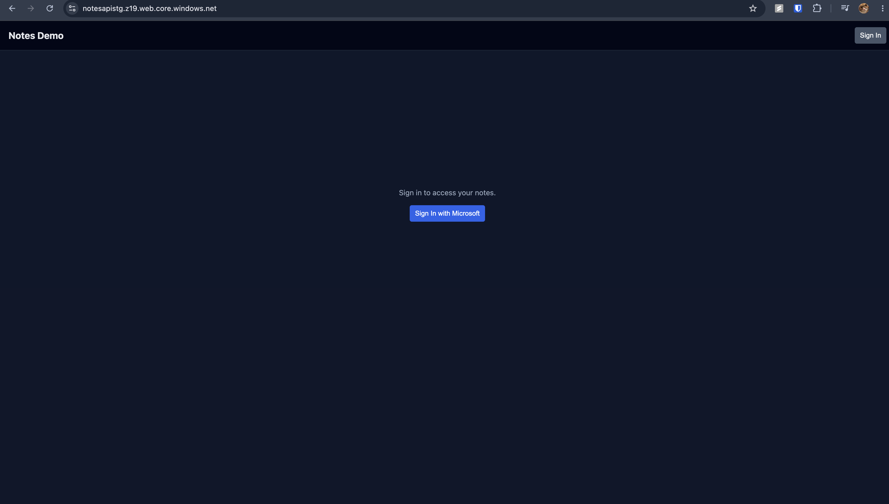
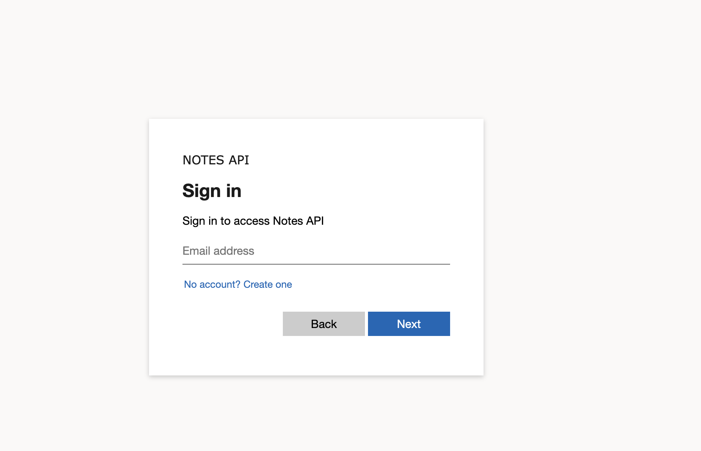
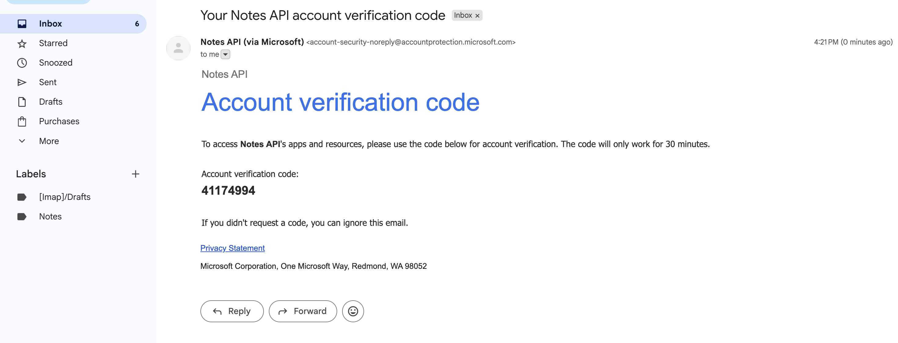
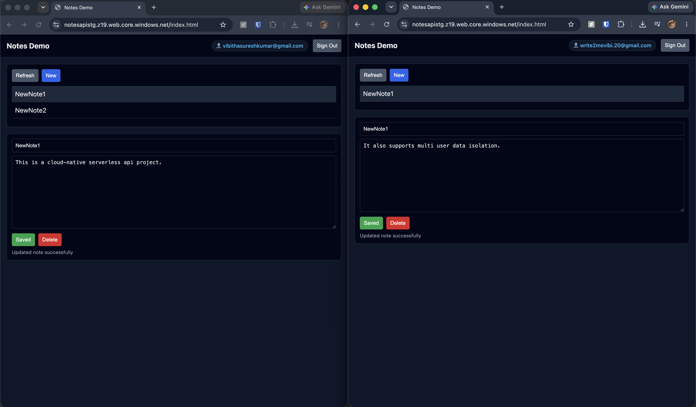

# Serverless_Notes_API
> Simple Serverless multi-user Cloud-Native CRUD API

### 📌 Overview
This project is a demonstration of a fully automated, cloud-native, serverless CRUD API buit on Azure using Azure Functions, Azure Cosmos DB, and Azure Blob Storage. It supports multi-user data isolation and is secured with Microsoft External Entra ID.

### 🏗️ Setup Architecture

### 🚀 Features
- Serverless CRUD API — Implements REST-style endpoints using the Azure Functions Python v2 programming model for creating, retrieving, listing, updating, and deleting records.

- Authenticated REST Endpoints  — All REST endpoints require a valid Entra External ID access token. The function code validates the JWT signature against the Entra JWKS endpoint and rejects unsigned or expired tokens with HTTP 401.

- Per-User Data Isolation — The Cosmos DB partition key /owner is set from the JWT sub claim. Each user can only read and write their own notes — enforced at the storage layer, not just the application layer.

- PKCE OAuth2 Flow — The SPA utilizes the Authorization Code Flow with PKCE for secure, secretless authentication in the browser. The authentication callback exchanges the auth code for access tokens and manages session state via sessionStorage for clean logouts.

- Stateless Compute Layer — All the above mentioned operations are handled by a single Function App on a consumption plan — zero idle cost, scales on demand.

- Managed NoSQL Storage — Uses Cosmos DB (SQL API) with a provisioned throughput container, partition key /owner, and UUID-based item IDs.

- Browser-Based Test Client — A simple static website built by HTML demonstrates real-time interaction with the API without requiring additional tooling.

### 🔑 External Entra ID Setup
*Create Entra External ID Tenant*

*Sign-In/Sign-Up UserFlow*

*Register SPA in External Tenant* 

### 🪧Application Flow & Demonstration

1. Frontend Landing Page: The initial view of the Static Web App before logging in.

2. SignIn/SignUp.

3. JWT Email Verification

4. Workspace after Authentication.

5. Storage Verification (Cosmos DB Container)

### 🚀 API Endpoints

All endpoints require `Authorization: Bearer <access_token>` and return JSON.

| Method | Path | Purpose | Input | Cosmos DB Operation |
|---|---|---|---|---|
| POST | `/api/notes` | Create a new note | JSON body (`title`, `note`) | `create_item` |
| GET | `/api/notes` | List caller's notes | None (owner from JWT) | `query_items` |
| GET | `/api/notes/{id}` | Get a single note | Path param (`id`) | `read_item` |
| PUT | `/api/notes/{id}` | Update a note | Path param + JSON body | `replace_item` |
| DELETE | `/api/notes/{id}` | Delete a note | Path param (`id`) | `delete_item` |

| Aspect | Behavior |
|---|---|
| Authentication | Entra External ID JWT (Bearer token, RS256) |
| Authorization | Owner scoped — callers can only access their own notes |
| Content-Type | `application/json` |
| Unauthenticated | HTTP 401 |
| Not found / wrong owner | HTTP 404 |

### ⚙️ How It Works

> This is a serverless microservice architecture where Azure Functions handle HTTP routing and JWT validation, Cosmos DB provides fully managed NoSQL persistence scoped per authenticated user, and Blob Storage hosts the static frontend.

